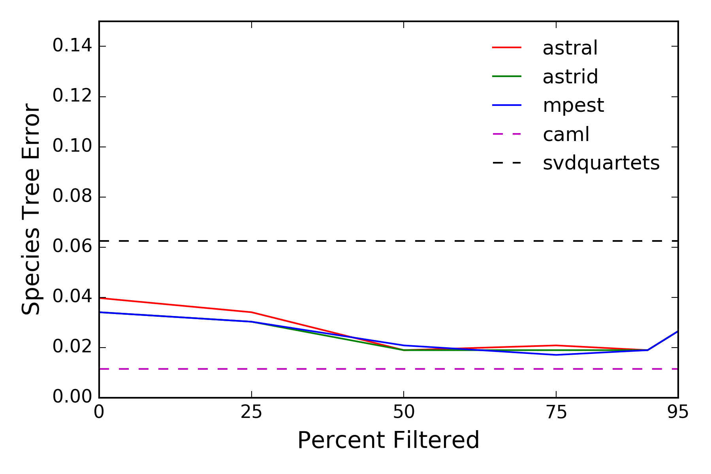
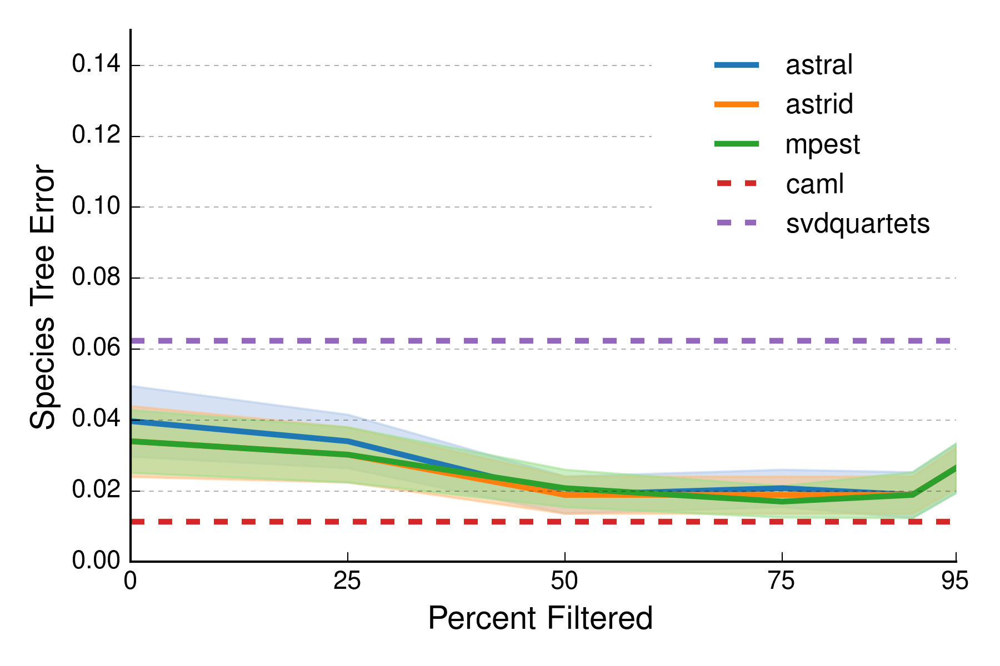

# Preparing the Data Frame with Pandas
Run [python script](prepare_data_for_lineplot.py): `python prepare_data_for_lineplot.py`

# Making a Basic Line Plot with Matplotlib
Run [python script](make_basic_lineplot.py): `python make_basic_lineplot.py`  
Open [image file](basic_lineplot.png): `open basic_lineplot.png`

# Making a "Beautiful" Line Plot with Matplotlib
Run [python script](make_beautiful_lineplot.py): `python make_beautiful_lineplot.py`  
Open [image file](beautiful_lineplot.png): `open beautiful_lineplot.png`

# Creating a Figure with GridSpec

# Making a "Beautiful" Line Plot with Seaborn
http://mlwhiz.com/blog/2015/09/13/seaborn_visualizations/
