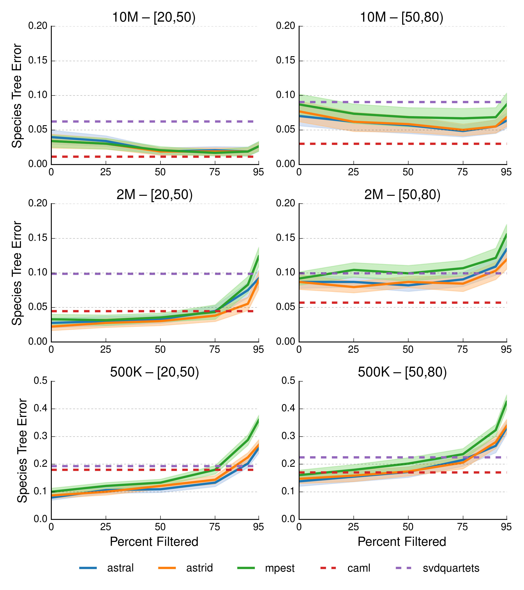

# Preparing the Data Frame with Pandas
Run [python script](prepare_data_for_lineplot.py): `python prepare_data_for_lineplot.py`

# Making a Basic Line Plot with Matplotlib
Run [python script](make_basic_lineplot.py): `python make_basic_lineplot.py`  
Open [image file](basic_lineplot.png): `open basic_lineplot.png`

# Making a "Beautiful" Line Plot with Matplotlib
Run [python script](make_beautiful_lineplot.py): `python make_beautiful_lineplot.py`  
Open [image file](beautiful_lineplot.png): `open beautiful_lineplot.png`

# Building a Figure with GridSpec
Run [python script](prepare_data_for_figure.py): `python prepare_data_for_figure.py`  
Run [python script](build_figure.py): `build_figure.py`  
Open [image file](figure_lineplot.png): `open figure_lineplot.png`

# Making a "Beautiful" Line Plot with Seaborn
Coming soon...
